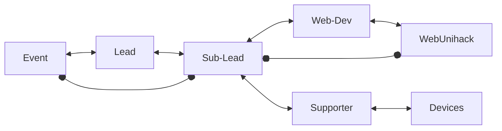

# Unihack 2023

## Technical Department
### Role
- Lead
- Sub-lead
- Web Developer
- Supporter
### What to do?
- Lead: Dũng
  - Quản lý về mọi thứ liên quan tới Technical của cuộc thi.
  - Tham gia buổi họp Lead sự kiện.
  - Báo cáo cho trưởng ban sự kiện.
  - Làm việc với thành viên phòng ban.
  - Cùng thảo luận và brainstorming sự kiện với các lead khác
- Sub-lead: 3 Technical Leads GDSC - DUT luân phiên
  - Support Lead về mọi thứ liên quan tới Technical.
  - Quản lý công việc của Web developer và supporter.
  - Cùng supporter làm kỹ thuật cho sự kiện (Bấm slide, chỉnh nhạc, điện đóm, ổ cắm).
  - Quản lý tiến độ của web Unihack 2023.
  - Thay Lead tham gia buổi họp với các lead sự kiện.
- Web developer: Duyên nhỏ, Kiệm, (Một bạn nữa nếu tuyển vào)
  - Code and code web Unihack 2023.
  - Cùng sub-lead tìm template dựa trên concept của cuộc thi.
  - Làm việc và báo cáo công việc cho sub-lead.
- Supporter: 1-2 bạn
  - Cùng sub-lead làm kỹ thuật cho sự kiện.
  - Giữ các thiết bị về technical (cái bấm slide, ổ cắm).
  - Làm việc với địa điểm tổ chức về thiết bị, mạng mẽo.
### Flow

